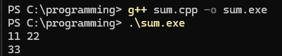
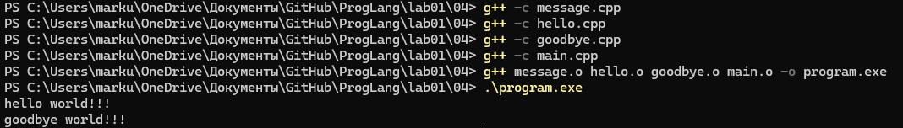
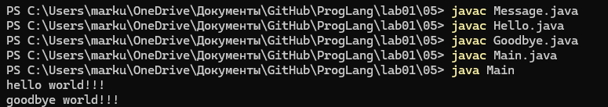
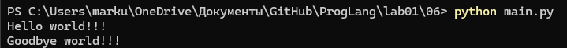
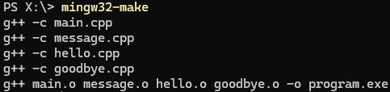
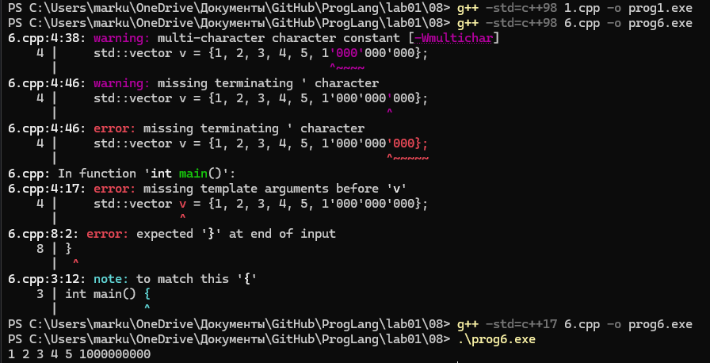
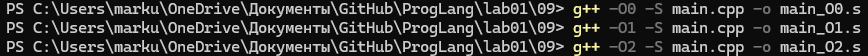

# Языки программирования
## Лабораторная работа 1
### Задание 1 **(4)**

* **Исходный код.** Текст программы на языке программирования
* **Объектный код.**  Это текст программы, уже переведенный на машинный язык, но еще не собранный в готовую к запуску программу
* **Исполняемый код.**  Это полностью готовая к запуску программа, в которой все объектные файлы соединены вместе и привязаны к конкретным адресам памяти
* **Исполняемый файл (исполняемый код)** файл, содержащий программу в виде набора элементарных инструкций, которая после загрузки в память может быть выполнена на определенном физическом устройстве (процессоре) под управлением опредленной операционной системы.
* **Ассемблер** язык программирования низкого уровня, в котором каждая инструкция физического устройства представлена в текстовом виде.
* **Виртуальная машина** это средство описания семантики языка программирования.
* **Стандарт языка программирования** документ, описывающий язык программирования максимально подробно и, по возможности, наиболее формально.
* **Транслятор** техническое средство, осуществляющее перевод текста программы с одного языка на другой.
* **Компилятор** Транслятор, переводящий программу в машинный код
для последующего исполнения. 
* **Интерпретатор** транслятор, читающий и исполняющий программу по одной команде.
* **Псевдокомпилятор** транслятор, переводящий программу в промежуточное представление (байт-код), который состоит из набора инструкций близких по смыслу к машинному коду
* **Компилирующий интрепретатор** транслятор, переводящий текст программы во внутреннем представление непосредственно после запуска. В процессе работы программа интерпретируется уже в этом представление (Python).
* **REPL-интерпретатор** Программное средство, работающее вцикле чтения-вычисления-печати (Read-Eval-Print Loop). Интерпретатор в режиме диалога считывает законченную конструкцию языка, транслирует ее, исполняет и выводит результат.
* **Единица трансляции** минимальный фрагмент программы,
который может быть транслирован независимо от остального кода (В языке Python единицей трансляции можно считать один модуль. В языке С++ единицей трансляции может являться один файл (с расширением .c, .cc, .cpp). За счет использования директивы #include одна единица трасляции может быть записана в нескольких файлах. В языке Java единицей трансляции является один публичный класс (фактически тоже один файл))
* **Препроцессинг (предобработка)**  начальный этап трансляции программы.
* **Сборка** заключительный этап трансляции, результатом которого является исполняемый файл.
* **make** утилита для управления процессом компиляции и сборки программ


### Задание 2 **(1)**

* **Alt+F1** Выбор диска на левой панели
* **Alt+F2** Выбор диска на правой панели
* **Shift + F4** Создать новый файл
* **Tab** Левая/правая панель переключение
* **F2** Сохранить файл
* **F4** Открыть файл
* **F7** Создать папку
* **F8** Удалить файл/папку
* **Стелки** Ходить по файлам/папкам
* **Enter** Зайти в папку, запустить файл
* **Ctrl+O** Открыть/закрыть терминал
* **Esc** Выйти из режима редактирования 


### Задание 3 **(1)**



### Задание 4. **(2)**




### Задание 5 **(2)**



### Задание 6 **(2)**



### Задание 7



### Задание 8



### Задание 9 **(3)**




* **O0** - без оптимизации
```
	.file	"main.cpp"
	.text
	.globl	main
	.def	main;	.scl	2;	.type	32;	.endef
	.seh_proc	main
main:
.LFB2766:
	pushq	%rbp
	.seh_pushreg	%rbp
	movq	%rsp, %rbp
	.seh_setframe	%rbp, 0
	subq	$48, %rsp
	.seh_stackalloc	48
	.seh_endprologue
	call	__main
	movl	$0, -4(%rbp)
	leaq	-12(%rbp), %rax
	movq	.refptr._ZSt3cin(%rip), %rcx
	movq	%rax, %rdx
	call	_ZNSirsERi
	movl	$0, -8(%rbp)
	jmp	.L2
.L3:
	movl	-12(%rbp), %eax
	addl	%eax, -4(%rbp)
	addl	$1, -8(%rbp)
.L2:
	cmpl	$122, -8(%rbp)
	jle	.L3
	movl	-4(%rbp), %edx
	movq	.refptr._ZSt4cout(%rip), %rax
	movq	%rax, %rcx
	call	_ZNSolsEi
	movl	$0, %eax
	addq	$48, %rsp
	popq	%rbp
	ret
	.seh_endproc
	.def	__main;	.scl	2;	.type	32;	.endef
	.ident	"GCC: (x86_64-posix-seh-rev0, Built by MinGW-Builds project) 16.1.0"
	.def	_ZNSirsERi;	.scl	2;	.type	32;	.endef
	.def	_ZNSolsEi;	.scl	2;	.type	32;	.endef
	.section	.rdata$.refptr._ZSt4cout, "dr"
	.p2align	3, 0
	.globl	.refptr._ZSt4cout
	.linkonce	discard
.refptr._ZSt4cout:
	.quad	_ZSt4cout
	.section	.rdata$.refptr._ZSt3cin, "dr"
	.p2align	3, 0
	.globl	.refptr._ZSt3cin
	.linkonce	discard
.refptr._ZSt3cin:
	.quad	_ZSt3cin
```
* **O1** - уже оптимизация
```
	.file	"main.cpp"
	.text
	.globl	main
	.def	main;	.scl	2;	.type	32;	.endef
	.seh_proc	main
main:
.LFB2809:
	subq	$56, %rsp
	.seh_stackalloc	56
	.seh_endprologue
	call	__main
	leaq	44(%rsp), %rdx
	movq	.refptr._ZSt3cin(%rip), %rcx
	call	_ZNSirsERi
	movl	44(%rsp), %edx
	movl	$123, %eax
	.p2align 3
.L2:
	subl	$1, %eax
	jne	.L2
	imull	$123, %edx, %edx
	movq	.refptr._ZSt4cout(%rip), %rcx
	call	_ZNSolsEi
	movl	$0, %eax
	addq	$56, %rsp
	ret
	.seh_endproc
	.def	__main;	.scl	2;	.type	32;	.endef
	.ident	"GCC: (x86_64-posix-seh-rev0, Built by MinGW-Builds project) 16.1.0"
	.def	_ZNSirsERi;	.scl	2;	.type	32;	.endef
	.def	_ZNSolsEi;	.scl	2;	.type	32;	.endef
	.section	.rdata$.refptr._ZSt4cout, "dr"
	.p2align	3, 0
	.globl	.refptr._ZSt4cout
	.linkonce	discard
.refptr._ZSt4cout:
	.quad	_ZSt4cout
	.section	.rdata$.refptr._ZSt3cin, "dr"
	.p2align	3, 0
	.globl	.refptr._ZSt3cin
	.linkonce	discard
.refptr._ZSt3cin:
	.quad	_ZSt3cin
```
* **O2** - еще больше оптимизация
```
	.file	"main.cpp"
	.text
	.section	.text.startup,"x"
	.p2align 4
	.globl	main
	.def	main;	.scl	2;	.type	32;	.endef
	.seh_proc	main
main:
.LFB2809:
	subq	$56, %rsp
	.seh_stackalloc	56
	.seh_endprologue
	call	__main
	movq	.refptr._ZSt3cin(%rip), %rcx
	leaq	44(%rsp), %rdx
	call	_ZNSirsERi
	movq	.refptr._ZSt4cout(%rip), %rcx
	imull	$123, 44(%rsp), %edx
	call	_ZNSolsEi
	xorl	%eax, %eax
	addq	$56, %rsp
	ret
	.seh_endproc
	.def	__main;	.scl	2;	.type	32;	.endef
	.ident	"GCC: (x86_64-posix-seh-rev0, Built by MinGW-Builds project) 16.1.0"
	.def	_ZNSirsERi;	.scl	2;	.type	32;	.endef
	.def	_ZNSolsEi;	.scl	2;	.type	32;	.endef
	.section	.rdata$.refptr._ZSt4cout, "dr"
	.p2align	3, 0
	.globl	.refptr._ZSt4cout
	.linkonce	discard
.refptr._ZSt4cout:
	.quad	_ZSt4cout
	.section	.rdata$.refptr._ZSt3cin, "dr"
	.p2align	3, 0
	.globl	.refptr._ZSt3cin
	.linkonce	discard
.refptr._ZSt3cin:
	.quad	_ZSt3cin
```
