# Языки программирования
## Лабораторная работа 3

### Задание 1 **(3)**

* **Тип в программировании** - атрибут объекта данных, задающий множество допустимых
значений и методы для работы с ними.

* **Статическая типизация** - Язык программирования обладает статической типизацией, если тип объекта данных определяется в момент трансляции. (Литералы — по записи литерала. Переменные и именованные константы — по объявлению. Результаты выражений — по оператору и типу операндов.)

* **Динамическая типизация** - Язык программирования обладает динамической типизацией, если тип объекта данных определяется на этапе выполнения программы в момент создания или присваивания значения. (Позволяет писать более обобщенные алгоритмы, текст программы выглядит компактнее, но снижается быстродействие, и но такая типизация не используется для раннего обнаружения ошибок)

* **Неявная типизация (утиная)** - Тип определяется на этапе трансляции автоматически по тексту программы. (When I see a bird that walks like a duck and swims like a duck and quacks like a duck, I call that bird a duck.)

* **Преобразование типа** - метод, преобразующий значение одного
типа в такое же или близкое значение другого типа.

* **Явное преобразование типа** - Преобразование типа называется явным, если оно указано в программе в виде вызова функции или в виде операции.

* **Неявное преобразование типа** - Преобразование типа называется неявным, если оно не присутствует в программе в виде конкретного указания, однако транслятор сам подставляет требуемый метод преобразования.

* **Каламбур типизации** - так называется ситуация, когда одна ячейка данных рассматривается как две переменные разных типов.

* **Сильная типизация** - язык программирования не содержит (почти не содержит) правил неявного преобразования типа.

* **Слабая типизация** - язык программирования содержит большое число правил неявного преобразования типа, допускает каламбуры типизации.

* Источник: презентация Лекция 3. Языки программирования. Типизация. <https://domic.isu.ru/student/entity/6373/content/lec03.pdf>

### Задание 2 **(3)**
*Правила неявного преобразования типов в языке С++*

**Преобразования при присваивании**

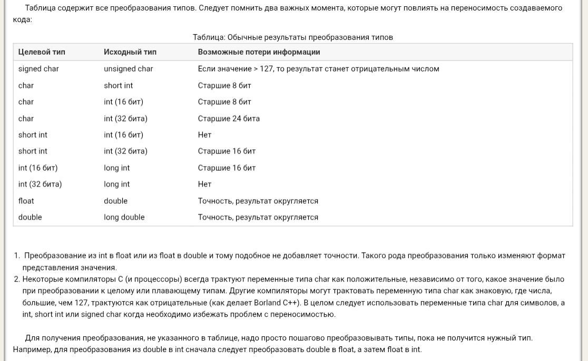
* Источник: <https://www.c-cpp.ru/books/preobrazovanie-tipov-pri-prisvaivanii>

**Преобразования при арифметических действиях**

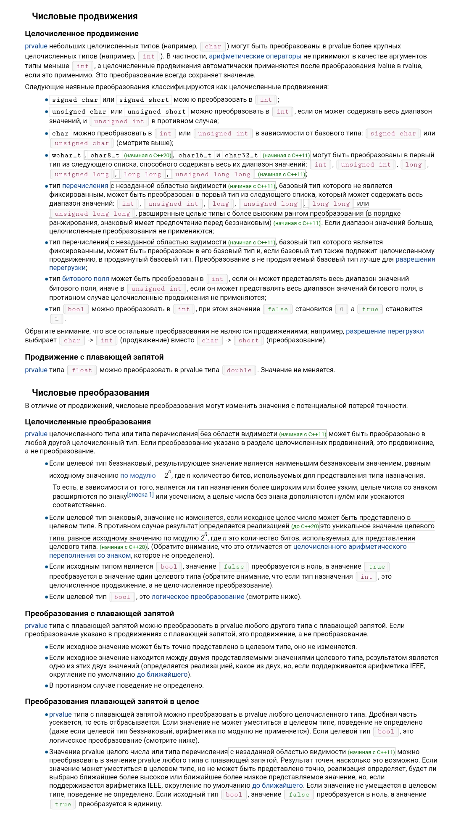
* Источник <https://ru.cppreference.com/cpp/language/implicit_cast>

*Преобразования с логическими значениями*

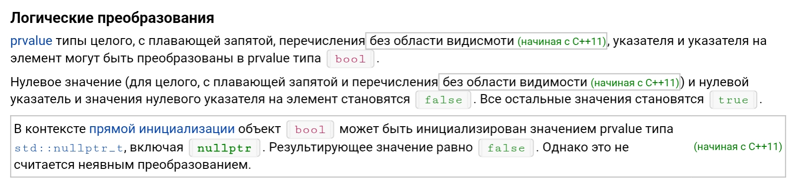
* Источник <https://ru.cppreference.com/cpp/language/implicit_cast>

### Задание 3 **(2)**

*Языки C++ и Java имеют похожий синтаксис, однако
язык С++ относят к языкам со слабой статической типизацией, а Java - с сильной статической типизацией.
Приведите примеры, показывающие это различие. Для этого вам надо подобрать несколько близких по смыслу фрагментов программ,
которые будут транслироваться в С++, но вызывать ошибку согласования типов в Java.*

*Записанные программы сохраните в папке с номером задания. В отчет запишите пояснения к работе программ.*

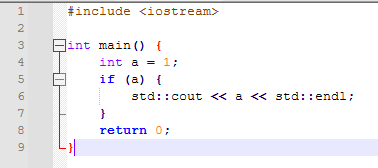
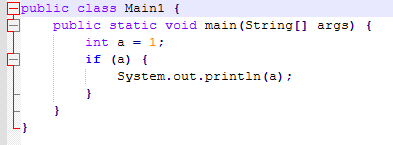
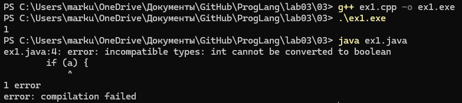

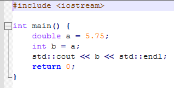
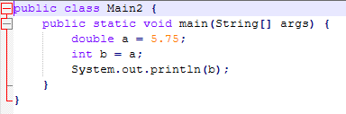
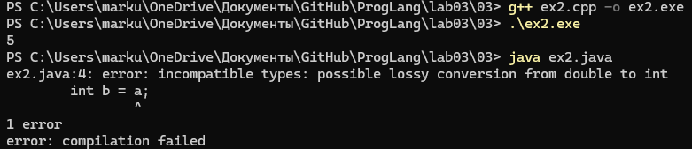

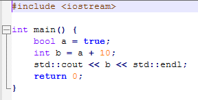
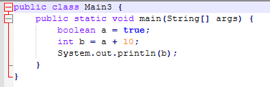
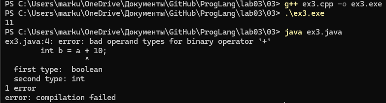

### Задание 4 **(1)**

*Рассмотрите следующий фрагмент программы.*

```
bool x = true, y = false;
auto a = x & y;
std::cout << typeid(a).name() << std::endl;
auto b = x && y;
std::cout << typeid(b).name() << std::endl;
```
*Используя* **typeid**, *найдите типы переменных* **a** и **b**. *Объясните результат.*

*Записанную программу сохраните в папке с номером задания.*

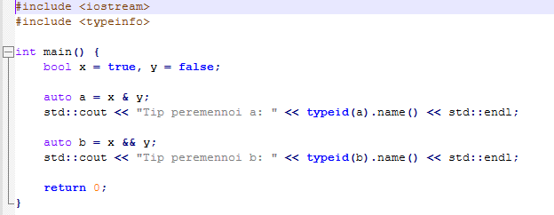
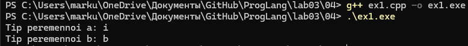

### Задание 5. **(2)**

*Приведите разумные (логичные) примеры использования в 
С++ ключевых слов* **typedef, auto, decltype, static_cast** и оператора **sizeof**.

*Записанные программы сохраните в папке с номером задания. В отчет запишите пояснения к программам*.

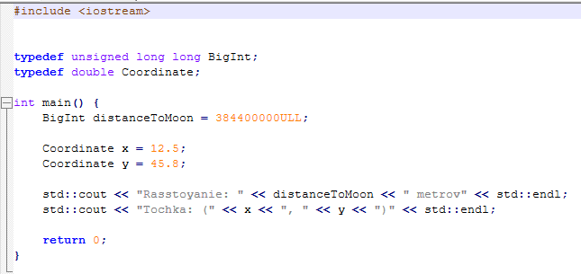
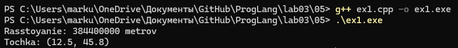

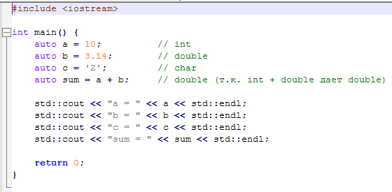
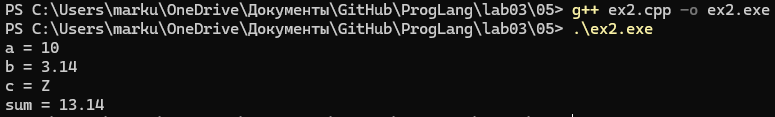

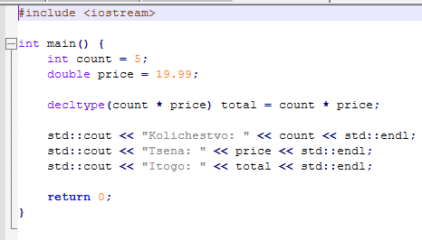
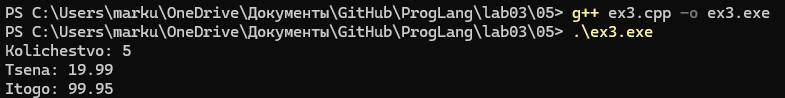

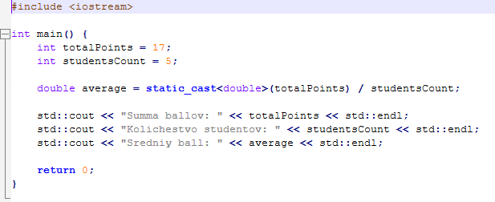
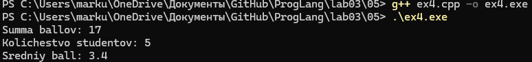

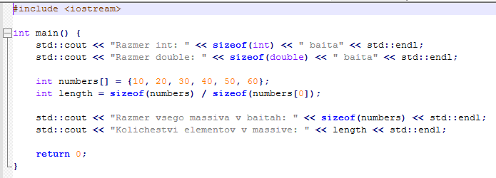
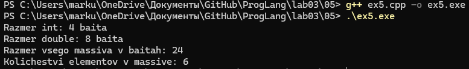

### Задание 6 **(2)**

Рассмотрите следующий фрагмент программы. 
```
int a = -1, b = 1;
unsigned int c = 1;
std::cout << a*b << std::endl;
std::cout << a*c << std::endl;
```
* *Объясните работу этой программы, используя правила неявного преобразования типов*
* *Что произойдет, если тип* **int** *заменить на* **short**, а **unsigned int** на **unsigned short**?*

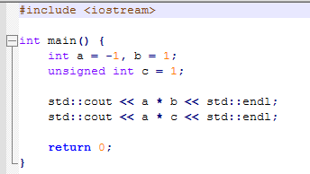
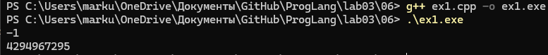

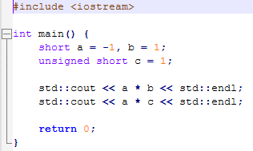
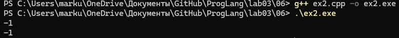

### Задание 7 **(2)**
*Рассмотрите следующий фрагмент программы.*
```
int x = 7, y = 4;
long double d = 0.25;
cout << (x / y) / d << endl;
cout << (x / d) / y << endl;
long a = 200000, b = 200000;
long long c = 200000;
std::cout << (a * b) * c << std::endl;
std::cout << a * (b * c) << std::endl;
```
*Почему изменения порядка действий приводит
к изменению результата? Объясните работу этой программы, используя правила неявного преобразования типов*

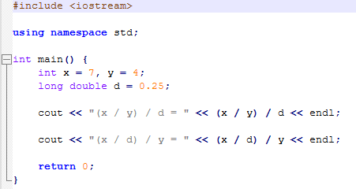
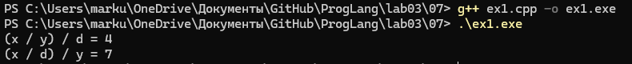

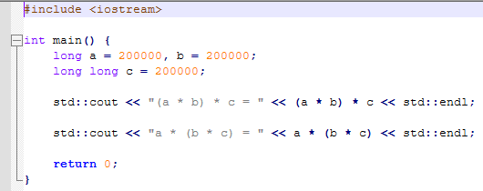
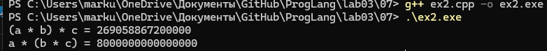

### Задание 8 **(2)**

*Для каких значений целочисленных переменных* **x**, **y** ,**z** *результатом
вычисления следующего выражения будет истина? Перечислите* **все** *случаи.
Объясните работу этой программы, используя правила неявного преобразования типов*

```
(x == y) + (x == z) == true
```

*Записанные программы сохраните в папке с номером задания.*

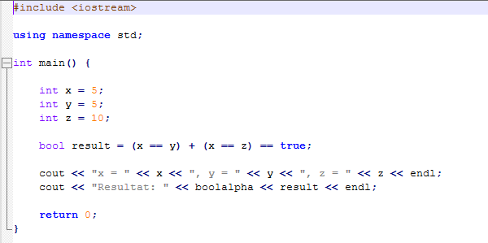
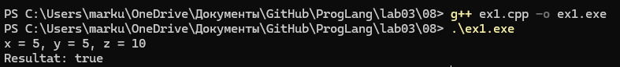

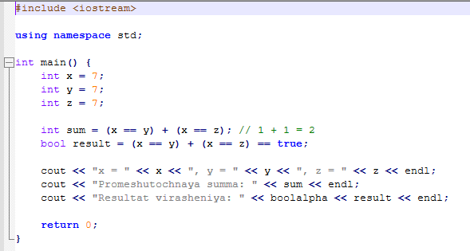
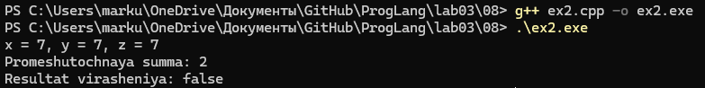

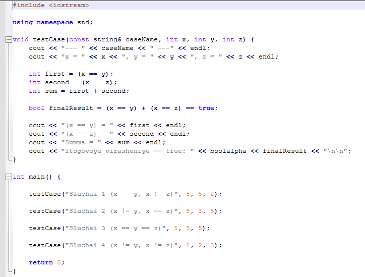
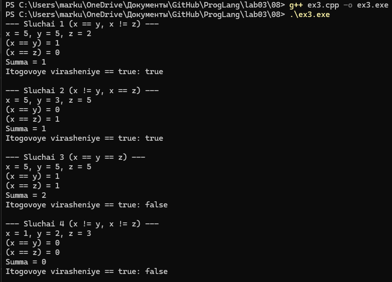

### Задание 9 **(2)**

*Проверьте работу логического выражения*
```
x==y==z
```
*в языках* **Python**, **Java**, **C++** *для
целочисленных переменных* **x**, **y**, **z**.
*Объясните результат для каждого из языков.*

*Записанную программу сохраните в папке с номером задания.*

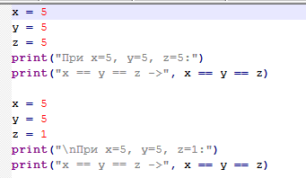
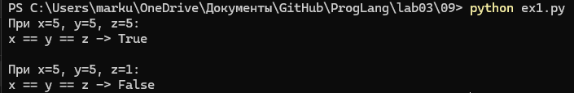

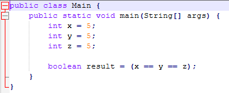
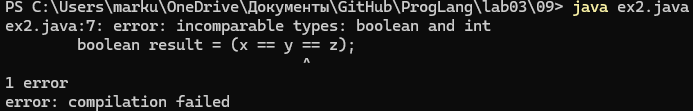

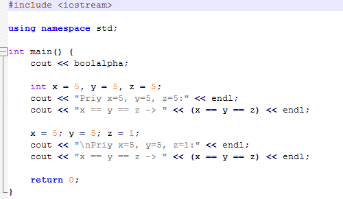
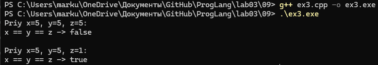

### Задание 10 **(1))**

*Напишите программу на* **Python** *, демонстрирующую возможность неявного преобразования
строки в логическое значение.*

*Записанную программу сохраните в папке с номером задания.*

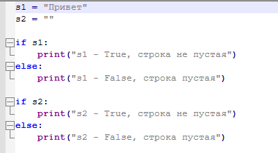
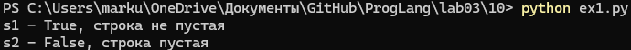

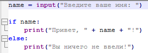
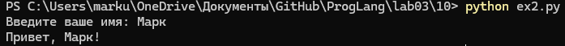

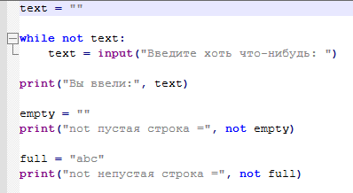
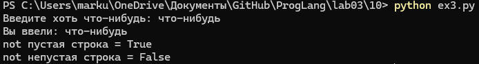


