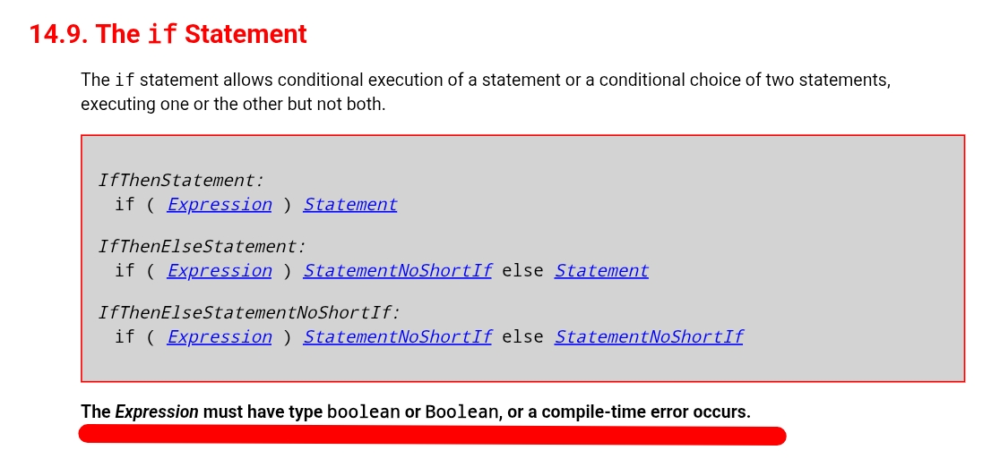
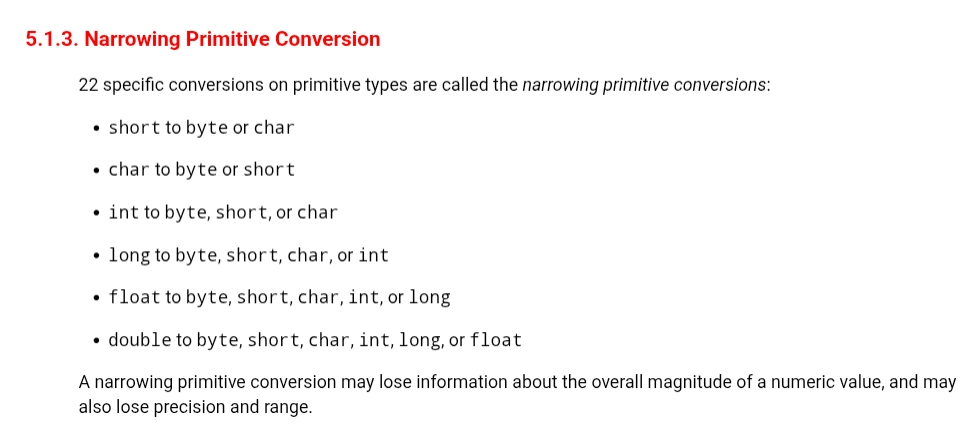
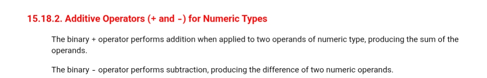
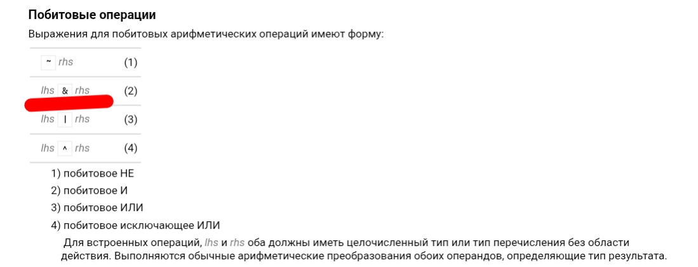
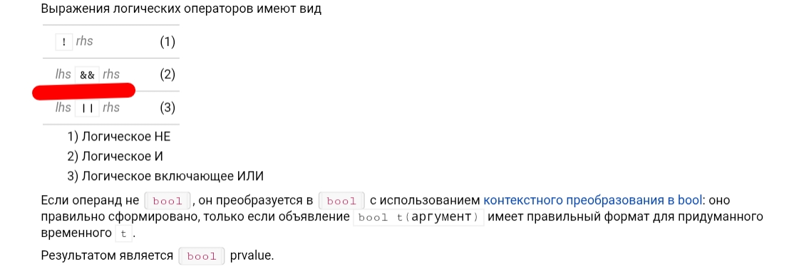

# Языки программирования
## Лабораторная работа 3

### Задание 1 **(3)**

* **Тип в программировании** - атрибут объекта данных, задающий множество допустимых
значений и методы для работы с ними.

* **Статическая типизация** - Язык программирования обладает статической типизацией, если тип объекта данных определяется в момент трансляции. (Литералы — по записи литерала. Переменные и именованные константы — по объявлению. Результаты выражений — по оператору и типу операндов.)

* **Динамическая типизация** - Язык программирования обладает динамической типизацией, если тип объекта данных определяется на этапе выполнения программы в момент создания или присваивания значения. (Позволяет писать более обобщенные алгоритмы, текст программы выглядит компактнее, но снижается быстродействие, и но такая типизация не используется для раннего обнаружения ошибок)

* **Неявная типизация (утиная)** - Тип определяется на этапе трансляции автоматически по тексту программы. (When I see a bird that walks like a duck and swims like a duck and quacks like a duck, I call that bird a duck.)

* **Преобразование типа** - метод, преобразующий значение одного
типа в такое же или близкое значение другого типа.

* **Явное преобразование типа** - Преобразование типа называется явным, если оно указано в программе в виде вызова функции или в виде операции.

* **Неявное преобразование типа** - Преобразование типа называется неявным, если оно не присутствует в программе в виде конкретного указания, однако транслятор сам подставляет требуемый метод преобразования.

* **Каламбур типизации** - так называется ситуация, когда одна ячейка данных рассматривается как две переменные разных типов.

* **Сильная типизация** - язык программирования не содержит (почти не содержит) правил неявного преобразования типа.

* **Слабая типизация** - язык программирования содержит большое число правил неявного преобразования типа, допускает каламбуры типизации.

* Источник: презентация Лекция 3. Языки программирования. Типизация. <https://domic.isu.ru/student/entity/6373/content/lec03.pdf>

### Задание 2 **(3)**
*Правила неявного преобразования типов в языке С++*

**Преобразования при присваивании**


* Источник: <https://www.c-cpp.ru/books/preobrazovanie-tipov-pri-prisvaivanii>

**Преобразования при арифметических действиях**


* Источник: <https://ru.cppreference.com/cpp/language/implicit_cast>

*Преобразования с логическими значениями*


* Источник: <https://ru.cppreference.com/cpp/language/implicit_cast>

### Задание 3 **(2)**

*Языки C++ и Java имеют похожий синтаксис, однако
язык С++ относят к языкам со слабой статической типизацией, а Java - с сильной статической типизацией.
Приведите примеры, показывающие это различие. Для этого вам надо подобрать несколько близких по смыслу фрагментов программ,
которые будут транслироваться в С++, но вызывать ошибку согласования типов в Java.*

* **Пример 1 (Оператор if):**
* Согласно разделу спецификации **JLS 14.9**, выражение внутри управляющей конструкции `if` строго требует тип `boolean` или `Boolean` (*«The Expression must have type boolean or Boolean»*). В отличие от языка C++, который неявно приводит любые ненулевые числовые значения к `true`, в Java автоматическое приведение типа `int` к `boolean` запрещено, что приводит к ошибке компиляции `incompatible types`.

Источник: <https://docs.oracle.com/javase/specs/jls/se8/html/jls-14.html>


* **Пример 2**
* В данном примере демонстрируется попытка присвоить переменной типа `int` значение типа `double`. Язык Java обладает сильной типизацией и полностью запрещает выполнять подобные операции неявно, так как они ведут к потере точности и отсечению дробной части. Компилятор блокирует сборку с ошибкой `possible lossy conversion`. В C++ такое преобразование выполняется автоматически.

Источник: <https://docs.oracle.com/javase/specs/jls/se17/html/jls-5.html>


* **Пример 3 (Арифметика с логическим типом):**
* В C++ тип `bool` является частью целочисленных типов, поэтому значение `true` при участии в арифметических операциях неявно продвигается до `int` (равного `1`). Однако в Java, согласно разделу **JLS 15.18.2**, бинарный оператор сложения `+` может применяться строго к операндам числового типа (*numeric type*). Поскольку тип `boolean` в Java полностью изолирован от чисел и не является числовым типом, компилятор выдает ошибку `bad operand types`.

Источник: <https://docs.oracle.com/javase/specs/jls/se7/html/jls-15.html>


### Задание 4 **(1)**

```
bool x = true, y = false;
auto a = x & y;
std::cout << typeid(a).name() << std::endl;
auto b = x && y;
std::cout << typeid(b).name() << std::endl;
```

* **Переменная a (оператор `&`):**
* Тип переменной определился как `i` (**int**). Как указано в документации `cppreference` (раздел «Побитовые операции»), операнды встроенного побитового оператора И (`&`) обязаны иметь целочисленный тип. Перед выполнением операции над переменными `x` и `y` типа `bool` автоматически применяется **целочисленное продвижение** (Integer Promotion), переводящее их в `int` (`1` и `0`). Соответственно, результатом операции `1 & 0` становится число типа `int`.


Источник: <https://ru.cppreference.com/cpp/language/operator_arithmetic>

* **Переменная b (оператор `&&`):**
* Тип переменной определился как `b` (**bool**). Согласно спецификации логических операторов на `cppreference`, встроенный оператор логического И (`&&`) всегда возвращает значение типа `bool` (*«Результатом является bool prvalue»*). В отличие от побитового оператора, здесь не происходит скрытого продвижения результата до целого числа, поэтому тип переменной сохраняется.


Источник: <https://ru.cppreference.com/cpp/language/operator_logical>


### Задание 5. **(2)**

*Рзумные (логичные) примеры использования в С++ ключевых слов* **typedef, auto, decltype, static_cast** и оператора **sizeof**.

* **typedef** - без него пришлось бы каждый раз полностью писать unsigned long long, выше шанс опечататься. typedef создаём короткий псевдоним BigInt, а также создаётся Coordinate вместо обычного double, чтобы программист сразу понимал смысл переменной (что это координата точки на карте, а не просто какое-то странное число).


* **auto** - компилятор сам определяет тип данных на ходу на основе того, что записываем в переменную, не нужно вручную вычислять, какой тип получится при сложении int a и double b. Компилятор выдает, что результатом выражения a + b будет double, и автоматически выделяет под переменную sum правильный объём памяти, защищая от ошибок потери точности.


* **decltype** - в отличие от auto, которое смотрит на конкретное значение, decltype смотрит за типом целого выражения ещё на этапе компиляции, при этом не запуская само вычисление. Почему в примере создаётся total именно так? Если завтра тип переменной price изменится в коде с double на другой (например, float), тип переменной total обновится автоматически без ручной переписки кода.


* **static_cast** - без него программа выдаст неверный результат. Если просто поделить totalPoints / studentsCount (17 на 5), то компилятор выполнит целочисленное деление, отбросит дробную часть и выдаст 3 вместо 3.4. Почему пишем static_cast<double>? Заставляем компилятор превратить одно из чисел в дробное, благодаря чему деление сохраняет точность и средний балл считается корректно.


* **sizeof** - без него не сможем узнать, сколько памяти программа выделяет под объекты на конкретном процессоре, ведь на разных компьютерах размеры типов могут отличаться. Также, почему делим sizeof(numbers) / sizeof(numbers[0])? Это единственный надёжный способ узнать количество элементов в классическом статическом массиве. Мы берём общий вес всего массива в байтах (24) и делим на вес одной ячейки (4), получая ровно 6 элементов. Если массив увеличится, формула сама пересчитает результат без изменения кода.


### Задание 6 **(2)**

Рассмотрите следующий фрагмент программы. 
```
int a = -1, b = 1;
unsigned int c = 1;
std::cout << a*b << std::endl;
std::cout << a*c << std::endl;
```


* По правилам обычных арифметических преобразований, если в операции участвуют типы одинакового ранга (int и unsigned int), то int неявно приводится к unsigned int. При переводе отрицательного числа -1 в беззнаковый тип происходит переполнение, и оно превращается в максимально возможное число для 32-битного инта — 4294967295. Затем 4294967295 * 1 дает этот огромный результат.


* Здесь срабатывает правило целочисленного продвижения (Integer Promotion). Арифметические операторы в C++ не умеют работать с типами меньше int. Поэтому компилятор сначала автоматически продвигает оба операнда (short и unsigned short) до обычного знакового типа int. Число -1 остается -1, а 1 остается 1. Операция выполняется int: -1 * 1 = -1.

### Задание 7 **(2)**
*Рассмотрите следующий фрагмент программы.*
```
int x = 7, y = 4;
long double d = 0.25;
cout << (x / y) / d << endl;
cout << (x / d) / y << endl;
long a = 200000, b = 200000;
long long c = 200000;
std::cout << (a * b) * c << std::endl;
std::cout << a * (b * c) << std::endl;
```
*Почему изменения порядка действий приводит
к изменению результата? Объясните работу этой программы, используя правила неявного преобразования типов*


* Выражение (x / y) / d: Скобки заставляют компилятор сначала выполнить x / y. Так как оба операнда int (\(7\) и \(4\)), происходит целочисленное деление — дробная часть отбрасывается, получается целое число 1. Затем 1 делится на long double d (\(0.25\)). По правилам обычных арифметических преобразований 1 неявно приводится к long double (\(1.0\)), и результат равен \(1.0 / 0.25 =\) 4.
* Выражение (x / d) / y: Сначала вычисляется x / d. Поскольку d имеет тип long double, int x автоматически неявно продвигается до long double (\(7.0\)). Деление происходит без потери точности: \(7.0 / 0.25 = 28.0\). Затем \(28.0\) делится на int y (\(4\)), который тоже продвигается до long double. Результат: \(28.0 / 4.0 =\) 7.


* Выражение (a * b) * c: Первым вычисляется a * b. Обе переменные имеют тип long (обычно это 32 бита, как и int). Результат \(200000 \times 200000 = 40000000000\), что не влезает в 32-битный тип (его предел \(\approx 2.14\) млрд). Происходит знаковое переполнение (Undefined Behavior / целое число зацикливается в минус). И только после этого полученный мусор умножается на long long c, неявно продвигаясь до 64 бит. Результат испорчен — 269058867200000.
* Выражение a * (b * c): Первым вычисляется b * c. Так как c имеет тип long long (64 бита), переменная b (long) автоматически неявно приводится к старшему типу long long. Умножение \(200000 \times 200000\) происходит сразу в 64-битном типе, где переполнения нет. Затем полученное правильное число умножается на a (которое тоже приводится к long long). Результат верный — 8000000000000000.

* Источник: <https://en.cppreference.com/cpp/language/usual_arithmetic_conversions>

### Задание 8 **(2)**

*Для каких значений целочисленных переменных* **x**, **y** ,**z** *результатом
вычисления следующего выражения будет истина? Перечислите* **все** *случаи.
Объясните работу этой программы, используя правила неявного преобразования типов*

```
(x == y) + (x == z) == true
```

*Записанные программы сохраните в папке с номером задания.*


* Сначала выполняются операторы равенства (x == y) и (x == z). Их результатом является тип bool (true или false). Затем между ними стоит знак сложения +.
* По правилам целочисленного продвижения (Integer Promotion), в C++ логический тип bool при участии в арифметических операциях автоматически преобразуется в тип int. При этом true превращается в 1, а false — в 0. Поэтому сложение результатов превращается в обычную математику: 1 + 0, 0 + 1, 1 + 1 или 0 + 0.


* Результат сложения (наша промежуточная сумма) сравнивается с true через == true.
* Почему так: Правая часть равенства (true) снова неявно продвигается до int и становится единицей (1). Выражение превращается в проверку: Промежуточная_сумма == 1.
  * Случай 1 и 2 (ИСТИНА): Если выполняется только x == y ИЛИ только x == z, мы получаем 1 + 0 = 1 или 0 + 1 = 1. Проверка 1 == 1 дает true (Случаи 1 и 2 на вашем третьем скриншоте).
	* Случай 3 (ЛОЖЬ): Если выполняются оба условия одновременно (x == y == z), мы получаем 1 + 1 = 2. Проверка 2 == 1 дает false (Второй скриншот с Promeshutochnaya summa: 2 и третий случай в тестах).
	* Случай 4 (ЛОЖЬ): Если ни одно условие не выполняется, мы получаем 0 + 0 = 0. Проверка 0 == 1 дает false.


* Выражение будет истинным тогда, когда переменная x равна строго одной из двух оставшихся переменных (y или z), но все три переменные не равны между собой одновременно.
* Случай 1: x == y, но x != z
* Случай 2: x == z, но x != y

### Задание 9 **(2)**

*Проверьте работу логического выражения*
```
x==y==z
```
*в языках* **Python**, **Java**, **C++** *для
целочисленных переменных* **x**, **y**, **z**.
*Объясните результат для каждого из языков.*

*Записанную программу сохраните в папке с номером задания.*


* Почему так работает: В Python реализована уникальная фича — сцепление операторов сравнения (operator chaining).
* Выражение x == y == z компилятор Python автоматически превращает в (x == y) and (y == z).
* При x=5, y=5, z=5: проверяется (5 == 5) and (5 == 5), что дает True and True \(\rightarrow \) True.
* При x=5, y=5, z=1: проверяется (5 == 5) and (5 == 1), что дает True and False \(\rightarrow \) False.


* В Java операторы выполняются строго слева направо, а сам язык обладает строгой типизацией.
* Выражение вычисляется как (x == y) == z.
  * Сначала вычисляется первая часть: 5 == 5, что дает логический тип boolean со значением true.
  * Затем компилятор пытается выполнить операцию true == z (то есть true == 5). Поскольку в Java запрещено сравнивать тип boolean с числовым типом int, компилятор падает с ошибкой incomparable types: boolean and int.


* В C++ операторы тоже выполняются слева направо (левоассоциативны), но в отличие от Java, здесь разрешены скрытые неявные преобразования.
* Выражение вычисляется как (x == y) == z.
  * При x=5, y=5, z=5: Вычисляется 5 == 5, получается тип bool со значением true. Затем идет проверка true == 5. По правилам целочисленного продвижения true превращается в число 1. Проверка 1 == 5 дает false.
  * При x=5, y=5, z=1: Вычисляется 5 == 5 \(\rightarrow \) true. Затем true превращается в 1. Проверка 1 == 1 дает true.

### Задание 10 **(1))**

*Напишите программу на* **Python** *, демонстрирующую возможность неявного преобразования
строки в логическое значение.*

*Записанную программу сохраните в папке с номером задания.*


