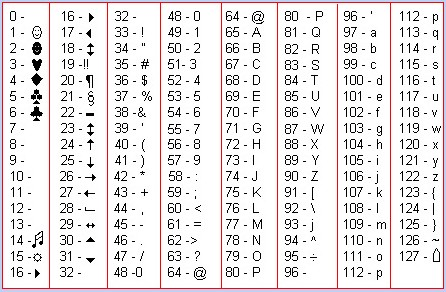
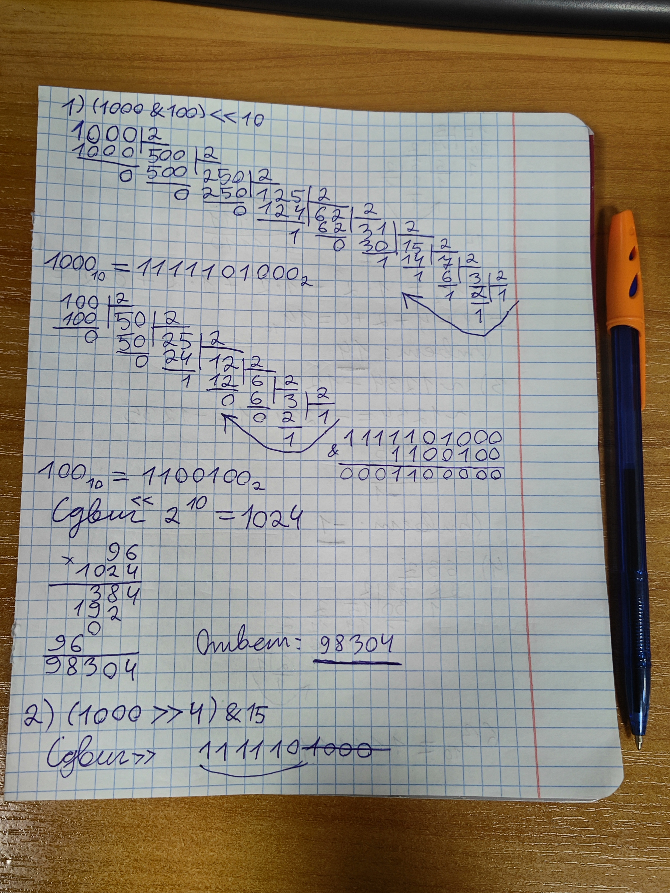
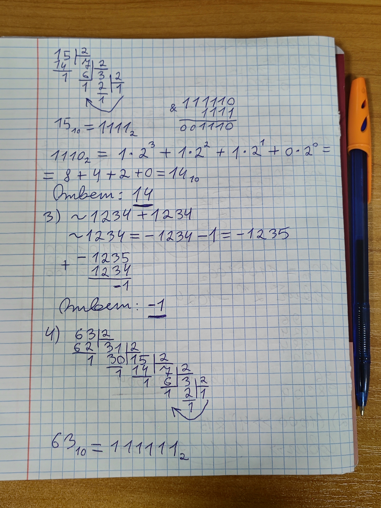
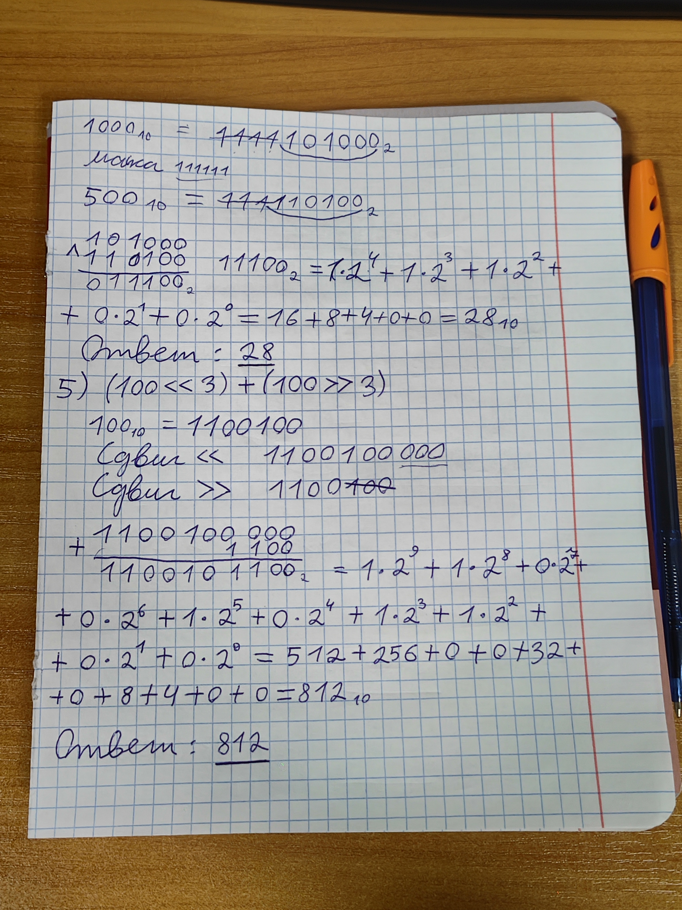

# Языки программирования
## Лабораторная работа 4

### Задание 1 **(3)**
* *Запишите двоичное представление числа -99 в целочисленном знаковом типе длиной 1, 2, 4 байта.* 
* *Запишите литералы равные наибольшему и наименьшему числу в типе* **int** *в шестнадцатеричной записи.*
* *Запишите двоичное представление символа "`#`" в типе* **char**.

---

- −99 в 1 байте - 10011101
- −99 в 2 байтах - 11111111 10011101
- −99 в 4 байтах - 11111111 11111111 11111111 10011101
- Наибольш. int: 0x7FFFFFFF
- Наименьш. int: -0x7FFFFFFF - 1
-  "`#`" это 35, в двоичной 00100011

---

### Задание 2 **(3)**
*Напишите пример программы на С++ с использованием целочисленных литералов в разных форматах записи, 
разной длины, знаковых и беззнаковых. 
Пример должен охватывать большинство способов записи целочисленных литералов.*

---

```
#include <iostream>

int main() {
    int a = 42;                  // десятичный
    int b = 052;                 // восьмеричный
    int c = 0x2A;                // шестнадцатеричный
    int d = 0b101010;            // двоичный
    int e = 1'000'000;           // разделитель разрядов

    unsigned int  u   = 42u;     // беззнаковый
    long          l   = 42L;     // long
    unsigned long ul  = 42UL;    // unsigned long
    long long     ll  = 42LL;    // long long
    unsigned long long ull = 42ULL;

    short s = -5;                // знаковый short
    unsigned short us = 65535;   // беззнаковый short
    char ch = 'A';               // символьный литерал
    unsigned char uch = 0xFF;    // 255

    std::cout << a << b << c << d << e << u << l << ul << ll << ull
              << s << us << ch << (int)uch << std::endl;
}
```

---

### Задание 3 **(2)**
*Объясните работу фрагмента программы на С++. В ходе объяснения следует использовать таблицу кодов символов.*
```
char a = 'a';
a = a + 10;
std::cout << a;
a = a + 250;
std::cout << a;
```

---


- Источник картинки: http://mojainformatika.ru/paskal/dopolnitelnyj-material-po-pascal/43-kodovaya-tablicza-ascii.html

- "`a`" по таблице ASCII имеет код 97
- 97 + 10 = 107, это символ "`k`"
- 107 + 250 = 357, в char (у char 8 бит, 2 в 8 степени = 256 значений) это не помещается, переполнение 357 - 256 = 101 (101 = "`e`")

- Выводит
```
ke
```

---

### Задание 4 **(2)**

*Перепишите программу из предыдущего задания на Python, используя функции* **chr** и **ord**.
*Почему ее вывод отличается от вывода программы на С++?*

---

```
a = 'a'
a = chr(ord(a) + 10)
print(a)
a = chr(ord(a) + 250)
print(a)
```

- Выводит
```
k
ť
```

- В Python у чисел нет переполнения, поэтому $107 + 250 = 357$ остаётся 357
- Строки в Python хранятся в Unicode, а не в 8 битах. Символ с кодом 357 существует, это ť
- В C++ char занимает 8 бит 2 в 8 степени = 256 значений, результат 357 - 256 = 101 (101 = "`e`")
- В print перевод строки по умолчанию в отличие от cout 

---

### Задание 5. **(2)**

*Объясните работу фрагмента программы на С++. В частности, почему* $x+x-x=x$, *но при этом*
$(x\cdot 2)/2\neq x$? *В отчете надо привести вычисления, приводящие к ответу.*
```
unsigned short x = 40000;
unsigned short y = x + x;
unsigned short z = x * 2;
y = y - x;
z = z / 2;
std::cout << y << " " << z << std::endl;
```

---


unsigned short 16 бит, 2 в 16 = до 65535

y = x + x = 40000 + 40000 = 80000  
y = 80000 - 65536 = 14464  
z = x * 2 = 40000 * 40000 = 80000  
z = 80000 - 65536 = 14464  
y = y - x = 14464 - 40000 = -25536  
y = -25536 + 65536 = 40000
z = 14464 / 2 = 7232  

```
40000 7232
```
---

### Задание 6 **(2)**

*Объясните работу фрагмента программы на С++. Если имеет место переполнение, 
то требуется найти точный ответ до запуска программы, а только потом сверить его с выводом.
В отчете надо привести вычисления, приводящие к ответу.*
```
std::cout << 2000000000 + 1000000000 << std::endl;
std::cout << 2000000000U + 1000000000U << std::endl;
std::cout << 2500000000U + 2500000000U << std::endl;
std::cout << 2500000000LL + 2500000000LL << std::endl;
std::cout << 20000U * 200000U << std::endl;
std::cout << 200000U * 200000U << std::endl;
```

---

* Тип `int` 32-битный: от $-2^{31}$ до $2^{31}-1$ ($2147483647$). 
* Тип `unsigned` — от 0 до $2^{32}-1$ ($4294967295$), $2^{32} = 4294967296$.

| `2000000000 + 1000000000` | $3\,000\,000\,000 > 2147483647$  `int`: $3000000000 - 4294967296$ | `-1294967296` |
| `2000000000U + 1000000000U` | $3\,000\,000\,000 < 4294967295$ | `3000000000` |
| `2500000000U + 2500000000U` | $5\,000\,000\,000 - 4\,294\,967\,296$ | `705032704` |
| `2500000000LL + 2500000000LL` | `long long` 64-битный | `5000000000` |
| `20000U * 20000U` | $400\,000\,000 < 4294967295$ | `400000000` |
| `200000U * 200000U` | $4\cdot10^{10} - 9 \cdot 4294967296 = 40000000000 - 38654705664$ | `1345294336` |

---

### Задание 7 **(2)**

*Напишите программу на Python умножающую введенное число на 1000. В программе 
можно использовать только операторы сдвига и сложения. Циклы использовать нельзя. Из функций
можно использовать только* **input** *и* **print** *для ввода и вывода.*
```
x = int(input())
y = ...
print(y)
```

---

1000 это 1111101000 в двоичной
```
x = int(input())
y = (x << 9) + (x << 8) + (x << 7) + (x << 6) + (x << 5) + (x << 3)
print(y)
```

---

### Задание 8 **(2)**

*Найдите результаты вычисления следующих выражений без использования компьютера
или калькулятора. Процесс вычислений должен быть отображен в отчете.*
* `(1000 & 100) << 10`
* `(1000 >> 4) & 15`
* `~1234 + 1234`
* `(1000 ^ 500) & 63`
* `(100 << 3) + (100 >> 3)`

---





---

###  Задание 9 **(2)**
*Напишите программу на языке С++ для умножения заданного целого числа на* $-1$. *В программе можно использовать только сложение и битовые
операции. Условия, циклы, библиотечные функции использовать нельзя.*

---

```
#include <iostream>

int main() {
    int x;
    std::cin >> x;
    int y = ~x + 1;
    std::cout << y << std::endl;
}
```
